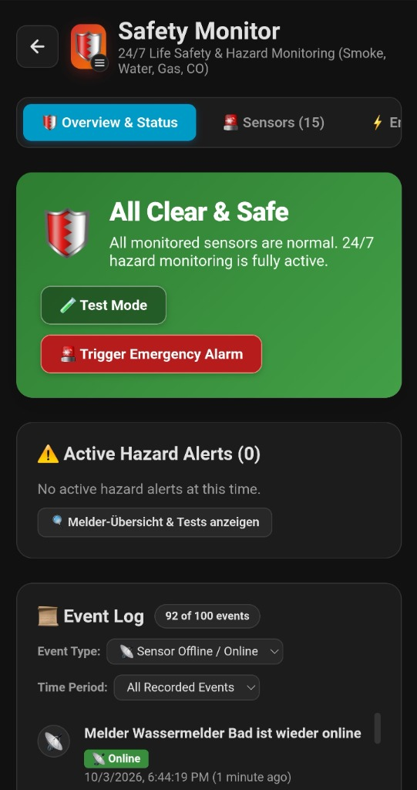
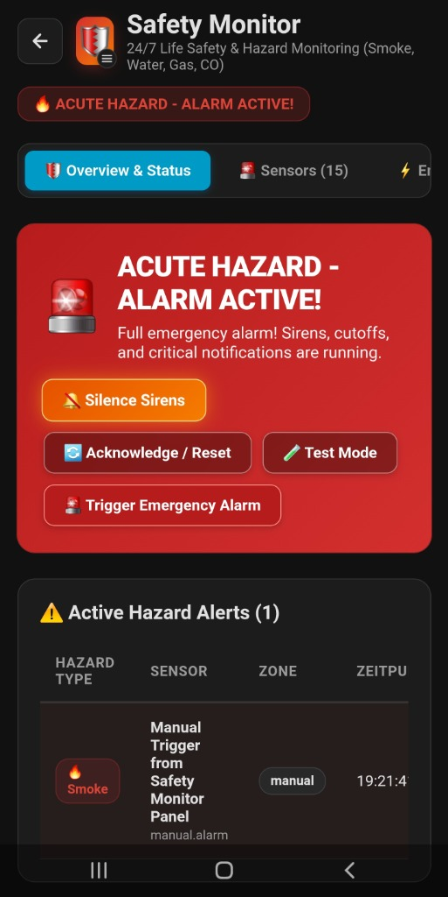

# 🛡️ Safety Monitor for Home Assistant

[](https://github.com/hacs/default)
[](https://github.com/vitals5/safety-monitor/releases)
[](https://opensource.org/licenses/Apache-2.0)
[](https://github.com/vitals5/safety-monitor/actions/workflows/validate.yml)

**Safety Monitor** is a dedicated **24/7 Life Safety & Hazard Protection System** for Home Assistant, inspired by [Alarmo](https://github.com/nielsfaber/alarmo).

While intrusion alarm systems are built around manual arming states (*Armed Away*, *Armed Home*, *Exit Delay*), critical hazard and property protection sensors (**Smoke, Water Leakage, Combustible Gas, Carbon Monoxide, and Extreme Heat**) require **24/7 Always-On** vigilance, phased escalation (shutoffs, priority push, sirens, post-alarm restore), false-alarm suppression (double-knock verification, pre-alarm delays), and proactive maintenance auditing (battery warnings, offline detection, automated monthly self-tests).

<p align="center">
  
  &nbsp;&nbsp;
  
</p>

---

## 📑 Table of Contents

- [Why Safety Monitor?](#-why-safety-monitor)
- [Key Features](#-key-features)
- [Architecture Overview](#-architecture-overview)
- [Installation](#-installation)
  - [HACS (Recommended - 1 Click)](#option-1-hacs-1-click-install-recommended)
  - [Manual HACS Repository](#option-2-manual-hacs-custom-repository)
  - [Manual Installation](#option-3-manual-zip-installation)
- [User Manual & Walkthrough](#-user-manual--walkthrough)
  - [1. Overview & Status Dashboard](#1-overview--status-dashboard)
  - [2. Event History Log with Advanced Filters](#2-event-history-log-with-advanced-filters)
  - [3. Sensors Management](#3-sensors-management)
  - [4. Zones & Multi-Sensor Verification (Double-Knock)](#4-zones--multi-sensor-verification-double-knock)
  - [5. The 5-Phase Escalation Engine](#5-the-5-phase-escalation-engine)
  - [6. Maintenance, Drills & Automated Self-Tests](#6-maintenance-drills--automated-self-tests)
- [Practical Use Cases & Examples](#-practical-use-cases--examples)
  - [Use Case 1: Multi-Room Fire Defense with HVAC Shutdown & Escape Route Lighting](#use-case-1-multi-room-fire-defense-with-hvac-shutdown--escape-route-lighting)
  - [Use Case 2: Whole-Home Water Leak Prevention with Main Valve Shutoff & All-Clear](#use-case-2-whole-home-water-leak-prevention-with-main-valve-shutoff--all-clear)
  - [Use Case 3: Carbon Monoxide (CO) / Gas Leak with Forced Ventilation & Critical Push](#use-case-3-carbon-monoxide-co--gas-leak-with-forced-ventilation--critical-push)
  - [Use Case 4: Kitchen Cooking False-Alarm Mitigation (Pre-Alarm + Physical Mute)](#use-case-4-kitchen-cooking-false-alarm-mitigation-pre-alarm--physical-mute)
  - [Use Case 5: Automated Monthly Smoke Detector Self-Test with Result Checking](#use-case-5-automated-monthly-smoke-detector-self-test-with-result-checking)
- [Entities, Services & Events Reference](#-entities-services--events-reference)
  - [Entities](#entities-created)
  - [Services](#services)
  - [Home Assistant Bus Events](#home-assistant-bus-events)
  - [Automations & Dashboard Examples](#automations--dashboard-examples)
- [License](#-license)

---

## 💡 Why Safety Monitor?

| Feature | Standard Home Assistant Automations | Intrusion Alarm Panels (e.g. Alarmo) | 🛡️ Safety Monitor |
| :--- | :--- | :--- | :--- |
| **Operating Model** | Scattered YAML/UI triggers | Arm / Disarm modes | **24/7 Always-On Protection** |
| **Accidental Disarming** | Easy to disable automations | Disarmed when occupants are home | **Impossible to disarm; always guarding** |
| **False-Alarm Safeguards** | Complex custom YAML templates | Simple entry delay | **Built-in Pre-Alarm & Double-Knock** |
| **Physical Detector Controls** | Manual script creation per device | N/A | **Direct Silence, Drill & Self-Test buttons** |
| **Emergency Escalation** | All-or-nothing actions | Siren turn-on | **5 Phased Stages (Cutoff, Push, Sirens, Restore, System)** |
| **Device Health Auditing** | Separate blueprints or templates | Battery sensor helpers | **Built-in Offline alerts, <15% battery & automated monthly tests** |
| **Dedicated UI Panel** | Custom dashboard cards required | Built-in panel | **Built-in full-featured Lit Web Component sidebar panel** |

---

## 🌟 Key Features

* **🛡️ 24/7 Always-On Hazard State Machine**: Never accidentally turned off.
  * `normal`: All monitored sensors safe. Green all-clear status.
  * `pre_alarm`: Verification countdown active (e.g. heat rise or awaiting second sensor confirmation).
  * `triggered`: Acute hazard confirmed! Emergency cutoffs, sirens, and high-priority push alerts execute.
  * `silenced`: External acoustic sirens temporarily silenced while 24/7 hazard monitoring remains fully armed.
  * `testing`: Safe maintenance mode for physical detector cleaning or testing; sirens and cutoffs are suppressed.
* **⚡ 5-Phase Escalation Engine**:
  * **Phase 1: Emergency Cutoff**: Instantaneous preventative shutoffs (e.g. shut main water valve, cut off HVAC fans, raise escape route shutters).
  * **Phase 2: Critical Push Notifications**: High-priority push alerts to mobile phones with alarm volume and critical bypass.
  * **Phase 3: Acoustic & Optical**: Trigger loud indoor/outdoor sirens, emergency red flashing illumination, and audio/TTS broadcasts.
  * **Phase 4: Restore & All-Clear**: Automated actions executed upon alarm reset (restore normal ventilation, send "All Safe" notification).
  * **Phase 5: Maintenance & System Alerts**: Proactive notifications for low battery (<15%), unreachable/offline detectors, and failed self-tests.
* **🔍 Auto-Discovery of Hazard Sensors**: Automatically inspects Home Assistant for compatible `binary_sensor` entities (`smoke`, `moisture`, `gas`, `carbon_monoxide`, `heat`).
* **🏠 Zones & Multi-Sensor Verification (Double-Knock)**: Group detectors into zones (e.g., *Kitchen*, *Basement*, *Living Room*). Require confirmation by a 2nd detector in the zone before sounding full evacuation alarms.
* **🧪 Sequential & Automated Monthly Self-Tests**:
  * Test all smoke alarms sequentially with staggered intervals (e.g. 60 seconds between detectors).
  * Automatically inspects result sensors (`sensor.*_last_self_test`) for success or failure.
  * Schedule automatic monthly self-tests to run unattended on a designated day and time.
* **📜 Advanced Event Log with Filtering**: Filter historical events by category (Alarms, Silenced, Resets, Self-Tests, Drills, Battery, Offline) and time periods (Last 1h, 6h, 12h, **Max. 24 Hours**, 3 Days, or All).
* **🌍 Multi-Language Support**: Fully localized in 10 major community languages: **English**, **Deutsch (German)**, **Français (French)**, **Español (Spanish)**, **Italiano (Italian)**, **Nederlands (Dutch)**, **Polski (Polish)**, **Português (Portuguese)**, **Русский (Russian)**, and **Svenska (Swedish)**. Automatically adapts to your Home Assistant user language or can be customized in *Zones & Settings*.
* **🔙 Smart Back Button**: Automatically displays a top-left return button (`← Back` / `← Zurück`) when navigated to from any Lovelace dashboard, smoothly taking you back to your previous dashboard view.
* **💻 Dedicated Custom Sidebar Dashboard**: Clean Lit / Web Component panel in Home Assistant's sidebar for complete sensor, zone, and action configuration without writing YAML.

---

## 🏛️ Architecture Overview

Safety Monitor runs natively within Home Assistant's async event loop:

```
┌────────────────────────────────────────────────────────────────────────┐
│                      Home Assistant Sidebar Panel                      │
│        [Overview & Status]  |  [Sensors]  |  [Actions]  |  [Zones]     │
└───────────────────────────────────┬────────────────────────────────────┘
                                    │ WebSocket API (safety_monitor/*)
┌───────────────────────────────────▼────────────────────────────────────┐
│                    Safety Monitor Integration Core                     │
│  ┌──────────────────────┐  ┌────────────────────┐  ┌────────────────┐  │
│  │    Safety Storage    │  │   State Machine    │  │ Auto Self-Test │  │
│  │ (.storage/safety_..) │  │(Normal/Warn/Alarm) │  │   Scheduler    │  │
│  └──────────┬───────────┘  └─────────┬──────────┘  └────────┬───────┘  │
│             │                        │                      │          │
│  ┌──────────▼────────────────────────▼──────────────────────▼───────┐  │
│  │                    Safety Sensor Coordinator                     │  │
│  │    (smoke, moisture, gas, carbon_monoxide, heat, battery, test)  │  │
│  └───────────────────────────────────┬──────────────────────────────┘  │
│                                      │                                 │
│  ┌───────────────────────────────────▼──────────────────────────────┐  │
│  │                    5-Phase Escalation Engine                     │  │
│  │   Phase 1: Cutoff  |  Phase 2: Push  |  Phase 3: Acoustic       │  │
│  │   Phase 4: Restore (All-Clear)       |  Phase 5: System Alerts   │  │
│  └───────────────────────────────────┬──────────────────────────────┘  │
└──────────────────────────────────────┼─────────────────────────────────┘
                                       │
                      Home Assistant Core & Event Bus
          (Services, Entities, Bus Events, Notifications, Lovelace)
```

---

## 🚀 Installation

### Option 1: HACS (1-Click Install - Recommended)

Click the button below to open Safety Monitor directly in your Home Assistant HACS:

[](https://my.home-assistant.io/redirect/hacs_repository/?owner=vitals5&repository=safety-monitor&category=integration)

1. Click **Download** in HACS.
2. Restart Home Assistant.
3. Click the button below to add the integration, or go to **Settings -> Devices & Services -> Add Integration** and search for **Safety Monitor**:

[](https://my.home-assistant.io/redirect/config_flow_start/?domain=safety_monitor)

---

### Option 2: Manual HACS Custom Repository

1. Open **HACS** in Home Assistant.
2. Click the three dots in the top right corner and choose **Custom repositories**.
3. Paste repository URL:
   ```
   https://github.com/vitals5/safety-monitor
   ```
4. Select Type: **Integration** and click **Add**.
5. Find **Safety Monitor**, click **Download**, and restart Home Assistant.
6. Navigate to **Settings -> Devices & Services -> Add Integration** and select **Safety Monitor**.

---

### Option 3: Manual ZIP Installation

1. Download the latest `safety_monitor.zip` from the [Releases](https://github.com/vitals5/safety-monitor/releases) page.
2. Unpack the archive and place the `safety_monitor` folder inside your Home Assistant `custom_components` directory:
   ```text
   /config/custom_components/safety_monitor/
   ```
3. Restart Home Assistant.
4. Go to **Settings -> Devices & Services -> Add Integration -> Safety Monitor**.

---

## 📖 User Manual & Walkthrough

Once installed, a new icon **Safety Monitor** (🛡️) will appear in your Home Assistant sidebar.

### 1. Overview & Status Dashboard

The Overview tab is your command center during daily operation and emergencies:

* **State Banner**:
  * 🟢 **All Clear & Safe (`normal`)**: 24/7 hazard monitoring active.
  * 🟡 **Pre-Alarm / Verification (`pre_alarm`)**: Potential hazard detected. Countdown timer running before external sirens sound.
  * 🔴 **ACUTE HAZARD - ALARM ACTIVE (`triggered`)**: Emergency confirmed! Sirens, cutoffs, and notifications running.
  * 🟠 **Alarm Silenced (`silenced`)**: Physical sirens silenced; full hazard monitoring remains armed.
  * 🔵 **Test & Maintenance Mode (`testing`)**: Sirens and cutoffs suppressed for maintenance.
* **Quick Controls**:
  * 🔕 **Silence Sirens**: Mute screaming sirens without disabling monitoring.
  * 🔄 **Acknowledge / Reset**: Reset the system back to normal once an incident is resolved.
  * 🧪 **Test Mode**: Put the system into maintenance mode (with automatic safety timeout).
  * 🚨 **Trigger Emergency Alarm**: Manually trip the full emergency alarm sequence.
* **Active Hazards Table**: Displays active triggers with hazard type, sensor name, zone, and timestamp.
  * 🔕 **Silence Detector**: If the detector has an associated silence entity, click this to mute the physical siren on that device.
  * 🙈 **Temporarily Ignore**: Mutes a faulty or lingering sensor until it returns to normal (`OFF`).
* **Low Battery Alert Banner**: Automatically flags any detector dropping below the 15% threshold.

---

### 2. Event History Log with Advanced Filters

Safety Monitor logs up to 100 historical incidents and operations with detailed timestamps, event badges, and elapsed time indicators.

* **Filter by Event Type (`Art des Ereignisses`)**:
  * **All Event Types**
  * 🚨 **Alarms & Hazards** (`sensor_triggered`, `manual_alarm`)
  * 🔕 **Silenced** (`silenced`, `sensor_silence`)
  * ✅ **Reset & All-Clear** (`reset`)
  * 🧪 **Self-Tests (All)** (`self_test_success`, `self_test_failed`, `sensor_test`)
  * ❌ **Self-Test Failed** (`self_test_failed`)
  * ✅ **Self-Test Passed** (`self_test_success`)
  * 🔔 **Alarm Drills** (`sensor_drill`)
  * 🛡️ **Test Mode** (`test_mode`)
  * 🪫 **Low Battery** (`battery_low`)
  * 📡 **Sensor Offline / Online** (`sensor_offline`, `sensor_online`)
  * 🙈 **Ignored / Reactivated** (`sensor_ignored`, `sensor_unignored`)
* **Filter by Time Period (`Zeitraum`)**:
  * **Max. 24 Hours** (Default standard view)
  * **Last 1 Hour**
  * **Last 6 Hours**
  * **Last 12 Hours**
  * **Last 3 Days**
  * **All Recorded Events**
* **Full Incident View**: Unlike basic systems that artificially truncate entries, Safety Monitor presents all events within your chosen timeframe in a smooth scrollable list with a count badge (e.g. `12 of 38 events`).

---

### 3. Sensors Management

The **Sensors** tab displays every monitored hazard detector and offers automatic discovery:

* **Auto-Discovery Banner**: Automatically scans Home Assistant states for binary sensors with device class `smoke`, `moisture`, `gas`, `carbon_monoxide`, or `heat`. Simply click **Monitor** to adopt a sensor into the safety system.
* **Configurable Attributes per Sensor**:
  * **Zone**: Assign the sensor to a room or building area.
  * **Hazard Type**: Smoke, Moisture, Gas, Carbon Monoxide, Heat, or Generic.
  * **Pre-Alarm Delay (seconds)**: Verification delay before sirens escalate (0 = immediate).
  * **Auto-Acknowledge on Clear**: Automatically resets the alarm when the physical sensor returns to `OFF`.
  * **Double-Knock (Multi-Sensor Verification)**: Require confirmation from another detector before sounding alarms.
  * **Linked Shutoff Actuators**: Specific valves or switches to actuate immediately for this detector.
  * **Silence Entity (`button` / `switch`)**: Mute button on the physical smoke detector.
  * **Drill Entity (`button`)**: Triggers an evacuation alarm drill on the device.
  * **Self-Test Entity (`button`)**: Hardware self-test button on the device.
  * **Self-Test Result Entity (`sensor`)**: Sensor reporting outcome (e.g., state `Erfolg`, `success`, or last test timestamp).
  * **Battery Entity (`sensor`)**: Battery level sensor (auto-detected if left empty).

---

### 4. Zones & Multi-Sensor Verification (Double-Knock)

Zones group detectors located in the same physical space (e.g., *Kitchen*, *Living Room*, *Basement*, *Server Room*).

* **Double-Knock Principle**:
  When a sensor trips in a zone with double-knock enabled:
  1. The system enters `pre_alarm` and starts a countdown (e.g., 60 seconds).
  2. If a **second** sensor confirms the hazard within the timeout window, the full alarm (`triggered`) is tripped immediately.
  3. If no second sensor triggers before the timer expires, the pre-alarm automatically expires without sounding loud evacuation sirens.
* **Per-Zone Timeouts**: Customize timeout durations independently per zone.

---

### 5. The 5-Phase Escalation Engine

Safety Monitor separates hazard reactions into 5 clear stages configured in the **Emergency Actions** tab:

```
[ Hazard Detected ]
        │
        ├─► Phase 1: Cutoff (Immediate preventive actions)
        │            • Close main water valve (valve.close_valve)
        │            • Turn off ventilation/HVAC (fan.turn_off)
        │            • Raise escape route roller shutters (cover.open_cover)
        │
        ├─► Phase 2: Priority Notifications (Mobile App push)
        │            • Critical alert bypassing 'Do Not Disturb'
        │            • Alarm stream audio channel with 100% volume
        │
        └─► Phase 3: Acoustic & Optical (Local evacuation alarms)
                     • Sound Zigbee/Z-Wave sirens
                     • Flash red illumination
                     • Play spoken TTS warnings on smart speakers
                     (Optional repetition loop while alarm is active)

[ Alarm Reset / All-Clear ]
        │
        └─► Phase 4: Restore & All-Clear (Post-Alarm recovery)
                     • Turn off emergency red lighting
                     • Restart ventilation
                     • Send "All Safe" notification to smartphones

[ Maintenance & System Alerts ]
        │
        └─► Phase 5: System Alerts (Hardware health warnings)
                     • Sensor battery drops below 15%
                     • Safety detector goes offline / unavailable
                     • Detector fails periodic self-test
```

#### Dynamic Placeholder Templates (Jinja2)
Use dynamic variables in your action titles, messages, and payloads:

| Variable | Description | Example Output |
| :--- | :--- | :--- |
| `{{ sensor_name }}` | Friendly name of triggering sensor | `Kitchen Smoke Detector` |
| `{{ entity_id }}` | Entity ID of triggering sensor | `binary_sensor.kitchen_smoke` |
| `{{ zone }}` | Name of zone | `Kitchen` |
| `{{ hazard_type }}` | Human-readable hazard type | `Rauch` / `Smoke` |
| `{{ timestamp }}` | Full timestamp | `03.10.2026 14:35:10` |
| `{{ time }}` | Time only | `14:35:10` |
| `{{ date }}` | Date only | `03.10.2026` |
| `{{ battery_level }}` | Battery percentage in Phase 5 | `9%` |
| `{{ failed_sensors }}` | Comma-separated list of failed detectors | `Bedroom Smoke, Hallway Smoke` |
| `{{ failed_count }}` | Number of failed detectors | `2` |

---

### 6. Maintenance, Drills & Automated Self-Tests

#### Maintenance / Test Mode
Activating Test Mode (`safety_monitor.test_mode`) prevents sirens and cutoff actuators from triggering while you test or vacuum dust out of physical smoke detectors. The mode automatically reverts to normal after a configurable duration (default: 15 minutes).

#### Individual Alarm Drills (`Alarmübung`)
In Test Mode, you can select any individual detector from a dropdown and click **Start Alarm Drill** to trigger an evacuation drill on that specific device.

#### Sequential Self-Test
Clicking **Start Sequential Self-Test** tests all configured detectors one after another:
1. Puts the system into Test Mode.
2. Triggers the self-test button on Detector 1.
3. Waits a configurable pause (e.g. 60 seconds).
4. Inspects the detector's test result entity (`test_result_entity`).
5. Proceeds to the next detector until all devices are verified.
6. Returns an all-clear or fires Phase 5 alerts with the names of any failing detectors.

#### Automated Monthly Self-Test
Under **Zones & Settings**, you can configure an automated monthly test:
* **Day of Month**: e.g., Day `1` of each month.
* **Time**: e.g., `11:00`.
* **Step Interval**: Pause duration per detector (e.g., 60 seconds).
* **Automatic Notification**: Executes Phase 5 actions if any detector fails.

---

## 🛠️ Practical Use Cases & Examples

### Use Case 1: Multi-Room Fire Defense with HVAC Shutdown & Escape Route Lighting

**Goal**: When a smoke or heat sensor triggers in any room, immediately shut down ventilation fans to prevent smoke spreading through ductwork, unlock exit doors, illuminate hallways red, and broadcast evacuation announcements.

#### Action Configuration

1. **Phase 1 (Cutoff)**:
   * **Service**: `fan.turn_off`
   * **Target**: `fan.whole_house_ventilation`, `fan.kitchen_exhaust`
   * **Payload**: `{}`
2. **Phase 1 (Cutoff)**:
   * **Service**: `cover.open_cover`
   * **Target**: `cover.living_room_shutter`, `cover.hallway_shutter`
   * **Payload**: `{}`
3. **Phase 2 (Notification)**:
   * **Service**: `notify.notify`
   * **Payload**:
     ```json
     {
       "title": "🚨 FIRE ALARM: {{ hazard_type | upper }} in {{ zone }}!",
       "message": "Hazard confirmed by {{ sensor_name }} at {{ time }}. Evacuate immediately!",
       "data": {
         "ttl": 0,
         "priority": "high",
         "channel": "alarm_stream",
         "push": {
           "sound": {
             "name": "default",
             "critical": 1,
             "volume": 1.0
           }
         }
       }
     }
     ```
4. **Phase 3 (Acoustic & Optical)**:
   * **Service**: `light.turn_on`
   * **Target**: `light.hallway_lights`, `light.staircase_lights`
   * **Payload**: `{"rgb_color": [255, 0, 0], "brightness": 255}`
5. **Phase 3 (Acoustic & Optical)**:
   * **Service**: `siren.turn_on`
   * **Target**: `siren.indoor_siren`
   * **Payload**: `{"tone": "fire"}`

---

### Use Case 2: Whole-Home Water Leak Prevention with Main Valve Shutoff & All-Clear

**Goal**: When water is detected under the washing machine or dishwasher, shut off the central motorized water inlet valve instantly and notify residents. Once cleared, send a restore confirmation.

#### Configuration
1. Monitored sensors: `binary_sensor.washing_machine_water`, `binary_sensor.kitchen_sink_leak`.
2. **Phase 1 Action**:
   * **Service**: `valve.close_valve`
   * **Target**: `valve.main_water_shutoff`
   * **Trigger types**: `moisture`
3. **Phase 2 Action**:
   * **Service**: `notify.notify`
   * **Payload**:
     ```json
     {
       "title": "💧 WATER LEAK IN {{ zone | upper }}",
       "message": "Water detected by {{ sensor_name }}. Main water valve has been closed automatically!",
       "data": { "priority": "high" }
     }
     ```
4. **Phase 4 (Restore) Action**:
   * **Service**: `notify.notify`
   * **Payload**:
     ```json
     {
       "title": "✅ Water Leak Resolved",
       "message": "Safety Monitor has been acknowledged. Remember to reopen the main water valve when ready."
     }
     ```

---

### Use Case 3: Carbon Monoxide (CO) / Gas Leak with Forced Ventilation & Critical Push

**Goal**: Carbon monoxide is colorless and odorless. If a CO detector trips, open motorized windows, activate exhaust fans at 100%, and sound high-priority alerts.

#### Configuration
1. **Phase 1 Action**:
   * **Service**: `cover.open_cover`
   * **Target**: `cover.skylight_roof`
   * **Trigger types**: `carbon_monoxide`, `gas`
2. **Phase 1 Action**:
   * **Service**: `fan.turn_on`
   * **Target**: `fan.emergency_exhaust`
   * **Payload**: `{"percentage": 100}`
   * **Trigger types**: `carbon_monoxide`, `gas`
3. **Phase 2 Action**: Critical notification sent with `ttl: 0` and critical sound bypass.

---

### Use Case 4: Kitchen Cooking False-Alarm Mitigation (Pre-Alarm + Physical Mute)

**Goal**: Cooking steak or opening an oven can cause brief steam or smoke. Prevent panic by delaying full siren escalation and allowing convenient silencing right at the detector or from the dashboard.

#### Sensor Configuration (`binary_sensor.kitchen_smoke`)
* **Pre-Alarm Delay**: `20 seconds`
* **Auto-Acknowledge on Clear**: `Enabled`
* **Silence Entity**: `button.kitchen_smoke_detector_silence`

#### How it works:
1. Smoke trips in the kitchen: Safety Monitor enters `pre_alarm`.
2. Residents have 20 seconds to open a window or press **Mute Detector** (`🔕`) in the dashboard or on the physical smoke alarm.
3. If muted or if the sensor clears within 20 seconds, the main external sirens never sound.

---

### Use Case 5: Automated Monthly Smoke Detector Self-Test with Result Checking

**Goal**: Comply with safety standards by testing all smoke detectors on the 1st of every month without manual ladder climbing.

#### Settings in Safety Monitor
* **Monitored Detectors**: Assign each detector's test button (`button.*_self_test`) and test result sensor (`sensor.*_last_self_test`).
* **Automated Monthly Self-Test**:
  * **Day of Month**: `1`
  * **Time**: `11:00`
  * **Step Delay**: `60` seconds
  * **Notify on Failure**: `Enabled`
* **Phase 5 Action**:
  * **Service**: `notify.notify`
  * **Payload**:
    ```json
    {
      "title": "🧪 Safety Monitor: Smoke Detector Test Failed!",
      "message": "Self-test failed on {{ failed_count }} detector(s): {{ failed_sensors }}. Please inspect batteries and hardware."
    }
    ```

---

## 📋 Entities, Services & Events Reference

### Entities Created

| Entity ID | Domain | Description | Extra Attributes |
| :--- | :--- | :--- | :--- |
| `alarm_control_panel.safety_monitor` | `alarm_control_panel` | Core 24/7 safety control panel. | `safety_state`, `active_sensors`, `active_zones`, `last_trigger`, `monitored_sensors_count` |
| `sensor.safety_monitor_status` | `sensor` | Current state (`normal`, `pre_alarm`, `triggered`, `silenced`, `testing`). | `active_triggers`, `offline_sensors` |
| `sensor.safety_monitor_last_hazard` | `sensor` | Name of the most recently triggered detector. | `entity_id`, `hazard_type`, `zone`, `timestamp` |
| `binary_sensor.safety_monitor_hazard_detected` | `binary_sensor` | `ON` if any hazard or pre-alarm is active. | `active_triggers_count`, `safety_state` |
| `binary_sensor.safety_monitor_test_mode_active` | `binary_sensor` | `ON` while test/maintenance mode is active. | N/A |

---

### Services

#### `safety_monitor.silence`
Temporarily silences acoustic sirens without disarming 24/7 monitoring.
```yaml
service: safety_monitor.silence
data:
  duration: 600  # Silence sirens for 10 minutes
```

#### `safety_monitor.reset`
Acknowledges safety alerts and returns system to normal.
```yaml
service: safety_monitor.reset
data:
  force: false  # Set to true to force reset even if sensors are still active
```

#### `safety_monitor.test_mode`
Toggles maintenance mode.
```yaml
service: safety_monitor.test_mode
data:
  enabled: true
  duration: 900  # Automatically revert to normal after 15 minutes
```

#### `safety_monitor.trigger`
Manually triggers the full emergency sequence (sirens, cutoffs, notifications).
```yaml
service: safety_monitor.trigger
data:
  reason: "Manual Evacuation Drill"
```

---

### Home Assistant Bus Events

Safety Monitor fires events on the Home Assistant event bus for custom automations:

* `safety_monitor_state_changed`: State transitioned (e.g. from `normal` to `pre_alarm` or `triggered`).
* `safety_monitor_sensor_triggered`: Sensor transitioned to `ON`.
* `safety_monitor_alarm_triggered`: Full emergency alarm activated.
* `safety_monitor_alarm_silenced`: Alarms silenced.
* `safety_monitor_alarm_reset`: Alarm reset to normal.
* `safety_monitor_test_mode_changed`: Test mode enabled/disabled.
* `safety_monitor_battery_low`: Monitored sensor dropped below battery threshold.
* `safety_monitor_sensor_offline`: Monitored sensor became unavailable.
* `safety_monitor_sensor_online`: Monitored sensor recovered online.
* `safety_monitor_self_test_failed`: Self-test failed on one or more detectors.
* `safety_monitor_self_test_completed`: Self-test completed successfully.

---

### Automations & Dashboard Examples

#### Example 1: Physical Zigbee Wall Button to Silence Alarms
```yaml
alias: "Physical Button: Silence Safety Sirens"
trigger:
  - platform: state
    entity_id: sensor.kitchen_switch_action
    to: "single"
condition:
  - condition: state
    entity_id: binary_sensor.safety_monitor_hazard_detected
    state: "on"
action:
  - service: safety_monitor.silence
    data:
      duration: 600
```

#### Example 2: Minimalist Lovelace Dashboard Card
```yaml
type: vertical-stack
cards:
  - type: tile
    entity: alarm_control_panel.safety_monitor
    name: Life Safety Monitor
    show_entity_picture: false
  - type: conditional
    conditions:
      - entity: binary_sensor.safety_monitor_hazard_detected
        state: "on"
    card:
      type: horizontal-stack
      cards:
        - type: button
          name: Silence Sirens
          icon: mdi:volume-off
          tap_action:
            action: call-service
            service: safety_monitor.silence
        - type: button
          name: Reset Alarm
          icon: mdi:restart
          tap_action:
            action: call-service
            service: safety_monitor.reset

#### Example 3: Dashboard Card with Smart Back Navigation
Place this card or button on any Lovelace dashboard to quickly jump into Safety Monitor. When clicked, the top-left **Back Button (Zurück)** automatically appears in the panel to bring you directly back to your dashboard!

```yaml
type: button
name: Safety Monitor
icon: mdi:shield-alert
tap_action:
  action: navigate
  navigation_path: /safety-monitor?back=1
```
*(Note: You can also use standard `/safety-monitor` without query parameters — automatic SPA detection will also recognize that you came from a dashboard).*
```

---

## 🧪 Testing

Safety Monitor includes an extensive, fully automated test suite:

```bash
python3 -m unittest discover -s tests -v
```

All 83 unit tests execute in under 5 seconds with zero external dependencies.

---

## 📄 License

This project is licensed under the Apache License 2.0 - see the [LICENSE](LICENSE) file for details.
